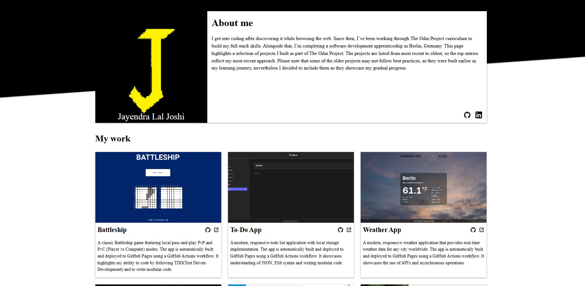

# Homepage

A responsive homepage showcasing projects I built during my learning journey with [The Odin Project](https://www.theodinproject.com/).

## About This Project

This homepage is a project from [The Odin Project](https://www.theodinproject.com/lessons/node-path-advanced-html-and-css-homepage#project-solution) Advanced HTML and CSS curriculum.

## What I Learned

Through this project, I learned how to create responsive layouts that look good on desktop, tablet, and mobile devices. I also practiced using `transform`, layering elements with `z-index`, and resizing images for different screen sizes.

## Technologies And Tools Used

- HTML5
- CSS3
- Git & GitHub Pages

## Getting Started

1. Open 'index.html' in your browser

## Live Demo

- GitHub Pages: https://jayendrajoshi.github.io/Homepage/

## Screenshots

## Resources

### Images
https://pixabay.com/de/photos/demn%c3%a4chst-ankommen-bekannt-zu-geben-2070393/
https://pixabay.com/de/photos/laptop-pflanze-schreibtisch-4948841/

### Icons
https://devicon.dev/
https://pictogrammers.com/library/mdil/icon/email/
https://pictogrammers.com/library/mdi/icon/phone/

### Typography
https://fonts.google.com/selection?query=roboto
https://fonts.google.com/specimen/Playfair?query=playfair

